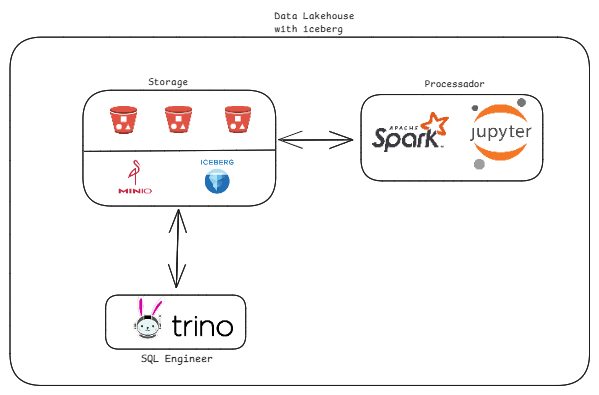

# PROJETO DATALAKEHOUSE COM ICEBERG

Projeto utilizando soluções open-source.

Ambiente com o intuito de praticar com tecnologias que o mercado utiliza, com a intenção de aumentar os serviços.

## Serviços:

- **DOCKER**: Utilizado para empacotar e distribuir aplicações.
- **MINIO**: Armazenamento de objetos compatível com a API AWS S3.
- **SPARK**: Processamento de dados distribuído.
- **TRINO**: Mecanismo de consulta SQL distribuído.
- **JUPYTER**: Ambiente de notebook interativo para análise de dados.
- **HIVE METASTORE**: Armazenamento de metadados para o Hive.
- **ICEBERG**: Formato de tabela otimizado para grandes volumes de dados




## Subir o Ambiente

```bash
sudo docker compose up -d
```

Após realizar os passos acima, o ambiente estará configurado.

Os serviços que contêm interface gráfica são MinIO, Jupyter e Spark.

A interface gráfica do Spark pode ser acessada ao executar algum job no Spark.
